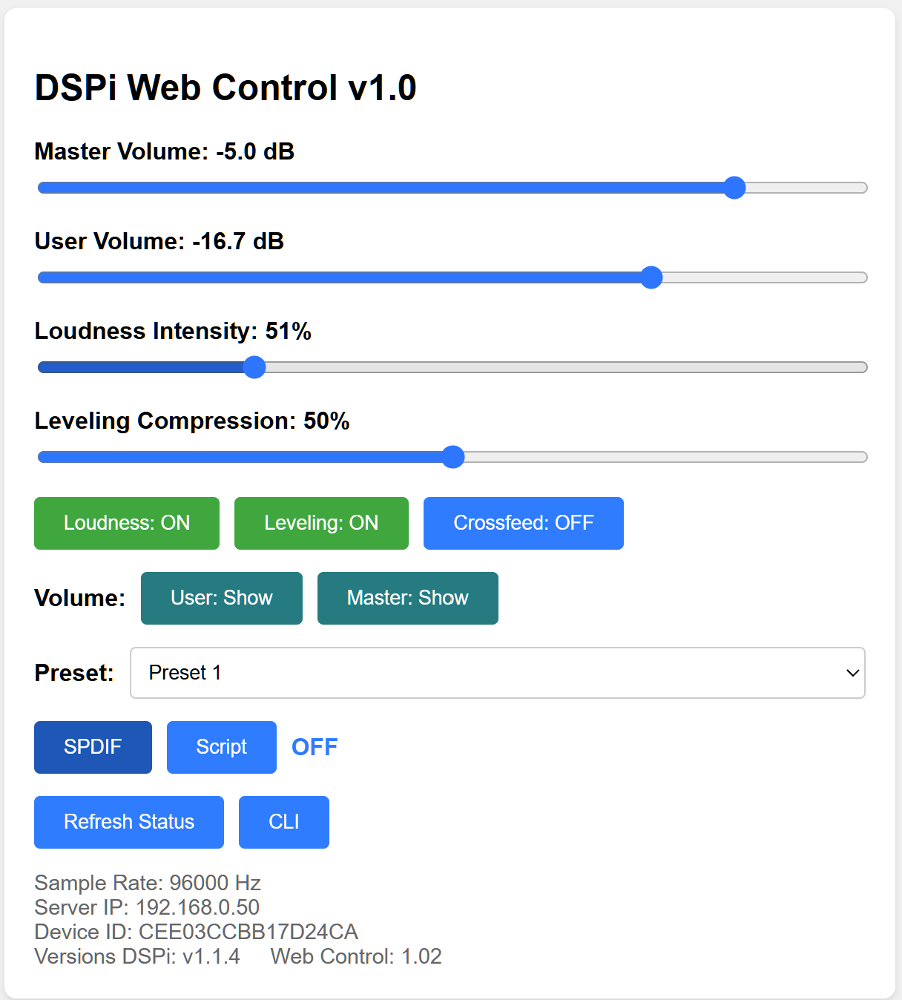

## DSPi CommandLine Client and Server
MZachmann

This is a tiny web page provider intended to work with the [WeebLabs DSPi project](https://github.com/WeebLabs/DSPi) that provides a quick 
gui via web browser.

### To prepare to run it:
* install .NET 10 if you haven't already (see below)
* download the latest release (zip file) from the [releases page](https://github.com/MZachmann/DSPiCliRemote/releases)
* * unzip that into a folder

### To run it:
* in that folder, run the server 
* it should print a few lines about which ports you've picked 
then it starts listening and just sits there
* run a browser and go to http://yourip:yourport to see the web page

### To build it:
* open the solution in Visual Studio or JetBrains Rider
* copy the two DSPi project (DSPiConsole.Usb and DSPiConsole.Core) into the solution folder

### What is it?

The **Server** is a small (about 5MB currently) console application that runs in Windows, 
Mac, and Linux (Ubuntu and Raspbian are tested).

Install/run it on the computer driving the DSPi Pico USB port. It takes very few resources.



The Server listens to two network ports (your choice which) and 
* the first port has a simple 
**web server that provides a one page GUI** to adjust volume, loudness and presets
* the second port allows **CLI clients** to attach for freeform text commanding.

The _optional_ **Client** is a smallish .NET Core / Amazonia application that runs in Windows, 
Mac, and Linux. It should run on any desktop (Windows, Mac, Linux). It has a small 
user interface that lets you send text queries and commands to the DSPi Pico and get text results. 
It also has a secondary Window with a display like the web page.

### non-Windows Operating System Installations
All of these use the labeled zips and (except Mac) need to make the program executable.

#### Mac OS X
Start by installing .NET 10 from the web.
Then install the libusb-1.0 library and ensure it is visible in the path.
Use Homebrew (brew) to install it: "brew install libusb".

On my mac it installed in /opt/homebrew/Cellar/libusb and to ensure dotnet found it I finally
just put a copy of the dylib into /usr/local/share/dotnet/shared/Microsoft.NETCore.App/10.0.7, the 
dotnet installation folder

After you try to run the app, unblock it
in the Privacy tab of the Security & Privacy settings and allow it to run/communicate.

#### Ubuntu & Raspbian
1. Follow step 2 of the instructions at this link to install .NET 10 on Ubuntu and Raspbian
https://learn.microsoft.com/en-us/dotnet/iot/deployment
2. They both require installation of libusb-1.0 via
```bash
sudo apt install libusb-1.0-0-dev 
```
3. The USB ports in Linux start read-only so you have to add permission to the USB port hardware.
The simplest approach is to run this bash script below which will give your user read-write
access to all USB devices.
```bash
# Create a group called usbwriters
sudo groupadd usbwriters
# Add you to the group
sudo usermod -a -G usbwriters $USER
# Allow access to the USB port by adding a rule granting the group access to the subsystem
echo 'SUBSYSTEM=="usb", MODE="0666", GROUP="usbwriters"' | sudo tee /etc/udev/rules.d/99-usbwriters.rules
# Reboot
echo "Please reboot"
```
That should be the prerequisites.

